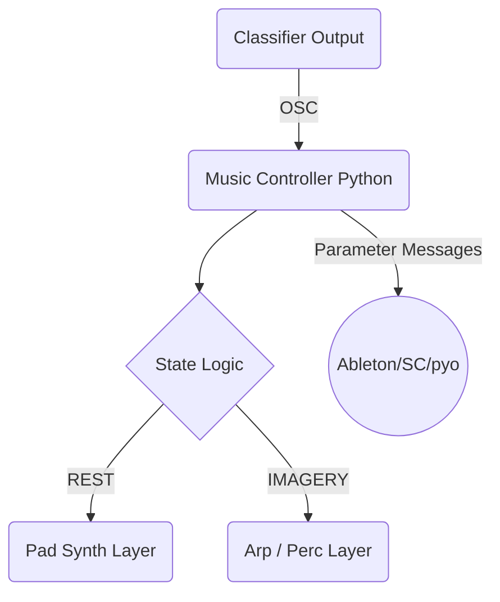

# Generative Music Algorithm – Brainstorming & Design Draft

## 1. Objectives
1. React to real-time BCI classifier output (REST ↔ IMAGERY) with musically meaningful changes.
2. Maintain a continuous, pleasant sonic texture while allowing clear contrast between states.
3. Keep computational load low (< 10 ms per window) to avoid audio drop-outs.
4. Remain modular: swap synthesis engine (DAW, SuperCollider, pyo) without rewriting core logic.

---

## 2. Control Signals from BCI System
| Signal | Type | Update Rate | Range | Notes |
|--------|------|------------|-------|-------|
| `state` | Discrete | ~1 Hz | {0 = REST, 1 = IMAGERY} | Smoothed majority vote (already implemented) |
| `prob_img` | Continuous | ~1 Hz | 0–1 | (Optional) classifier probability of imagery |
| Future: `engagement` | Continuous | 0.2 Hz | 0–1 | Rolling mean of beta power |

OSC Address proposal:
```
/bci/state <int>
/bci/prob_img <float>
/bci/engagement <float>
```

---

## 3. Musical Parameters to Modulate
1. **Texture / Instrumentation**
   • Layer A (Ambient Pad) – active during REST  
   • Layer B (Arpeggio / Rhythmic Motif) – fades in with IMAGERY
2. **Tempo** – slightly accelerate (±8 BPM) with `prob_img`.
3. **Filter Cutoff** – Map `prob_img` → low-pass cutoff (dull → bright).
4. **Reverb Mix** – REST: wetter; IMAGERY: drier to increase clarity.
5. **Pitch Space** – switch between consonant scale (REST) and more tension (Lydian♭7, Phrygian) in IMAGERY.

---

## 4. Algorithmic Composition Strategies
### 4.1 Rule-Based Motif Generator (Baseline)
• Pre-define four 8-note motifs in a chosen scale.  
• On IMAGERY onset ⇒ randomly pick motif and arpeggiate with 16-th subdivision.  
• Between motifs insert 1-bar rest to avoid clutter.

Pros: deterministic, easy to code; Cons: may sound repetitive.

### 4.2 Markov Chain Melody Engine
• Build transition matrix between scale degrees (order-2).  
• Seed with tonic; generate stream of notes.  
• Adjust transition probabilities with `prob_img` (higher excitement → more leaps).

### 4.3 Cellular Automata Rhythmic Layer
• 1-D CA (rule-90) across 16-step grid; live reseed pattern on state change.  
• Map '1' → trigger percussive sample; velocity scaled by `prob_img`.

### 4.4 Granular Pad Sculpting
• REST pad rendered from long sample; grains density tied to `engagement`.

### 4.5 L-System Chord Progression (Stretch Goal)
• Define grammar (e.g., `S→PT`, `P→IVV`, …)  
• Evaluate every 8 bars; choose rule set based on dominant brain state fraction.

---

## 5. High-Level Architecture


Music Controller Responsibilities:
1. Listen to OSC `/bci/*` messages.
2. Maintain internal state machine (REST, IMAGERY, TRANSITION).
3. Schedule/modify musical events via a second OSC stream out to audio engine.
4. Log events for later analysis.

---

## 6. Implementation Options
| Approach | Libraries / Tools | Notes |
|----------|------------------|-------|
| Python-MIDI sequencing | `mido`, `rtmidi` | Good for DAW via virtual MIDI port |
| Audio synthesis in Python | `pyo`, `csound` | Fast prototyping standalone |
| SuperCollider | Send OSC patterns | Rich synthesis, steep learning curve |
| Ableton Live | Max for Live device listening to OSC | Visual workflow |
| FoxDot / TidalCycles | Live-coding style | Good for algorithmic patterns |

Initial recommendation: **Python controller + SuperCollider synth patches** (pure OSC transport both ways, open-source, cross-platform).

---

## 7. Mapping Recipes (Pseudo-Code)
```python
if state_change:         # REST -> IMAGERY or vice versa
    if state == 1:
        schedule_layer("arp", on=True, fade=2)
        schedule_layer("pad", on=False, fade=4)
    else:
        # opposite change

# every 500 ms
send_osc("/filter/cutoff", map_lin(prob_img, 0, 1, 400, 4000))
send_osc("/tempo", 100 + prob_img*8)  # base 100 BPM
```

---

## 8. Open Questions
1. How many distinct musical "modes" are desirable (binary vs. multi-state)?
2. Should we embed user feedback (e.g., visual) into the music controller or keep separate?
3. Preferred audio engine among team members?
4. Need for recording final audio output for study analysis?

---

## 9. Next Steps
1. Prototype minimal **Pad + Arpeggio** patch in SuperCollider that responds to `/bci/state` & `/bci/prob_img`.
2. Extend real-time classifier to publish probability (`prob_img`) over OSC.
3. Conduct pilot session: capture EEG + generated music, gather subjective feedback.
4. Iterate on algorithmic layers (e.g., introduce Markov melody engine).

---
*Draft v0.1 – feel free to append ideas or comment inline.* 